### まずは登録

まずは GitHub に登録してアカウントを取得します。<a href="http://github.com">GitHub のトップページ</a>から "Plans, Pricing and Signup" を押して登録ページへと移動してください。

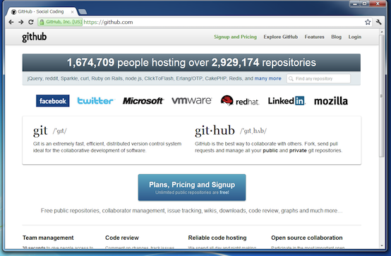

"Free for open source" を選びましょう。 "Create a free account" を押します。

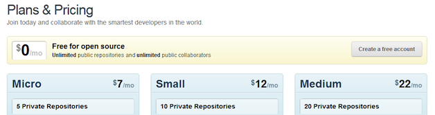

ユーザー名、メールアドレス、パスワードを入力して登録します。

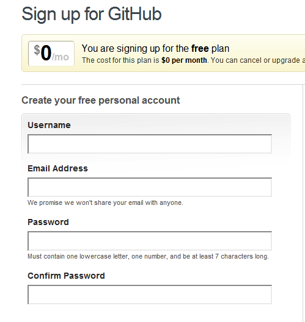

メールアドレスに確認のメールが届きます。入力した情報を使ってログインしましょう。

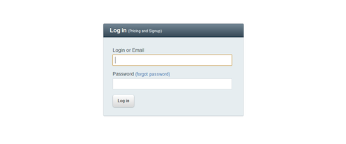

こんな感じで、ホーム画面へ遷移するはずです。

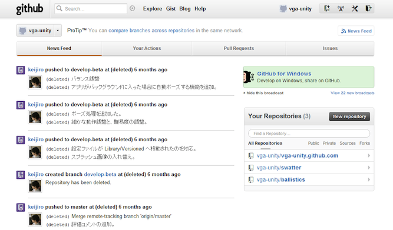

### GitHub for Windows

GitHub は本来 Git を使うためのサービスですが、これをもっとシンプルに使いやすくしたツールを GitHub 自身がリリースしています。それが [GitHub for Windows](http://windows.github.com) です。

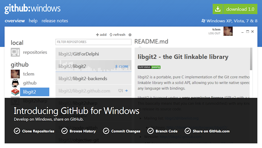

てきとうにインストールして立ち上げましょう。こんな感じになります。Metro 的な UI でカッコいいですね。

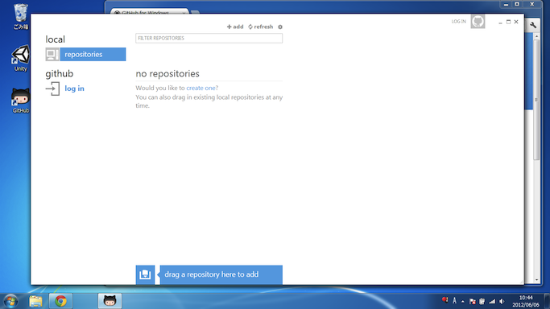

左側にある log in ボタンを押してログインします。先だって登録したメールアドレスとパスワードを入力してください。

ログインが完了したら、さっそく自分のリポジトリを作成してみましょう。上の方にある "+ add" ボタンを押します。

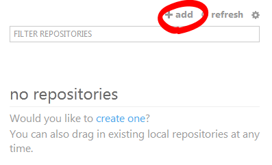

リポジトリの情報を入力する画面へ遷移します。リポジトリの名前と、簡単な説明文を入力します。

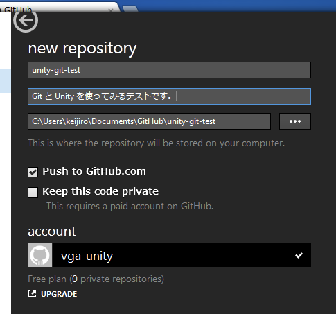

入力が完了したら "Create" ボタンを押してリポジトリを作成しましょう。

リポジトリの作成に成功すると、こんな感じで local 側にリポジトリが出現します。

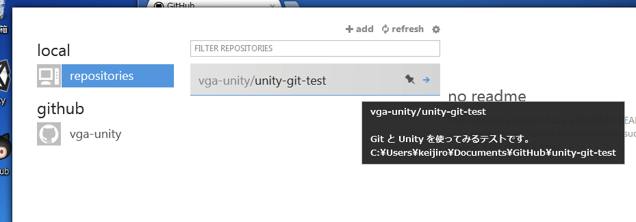

リポジトリが GitHub 側にも作成されていることを確認してみましょう。右クリックメニューから "view on github" を選択します。

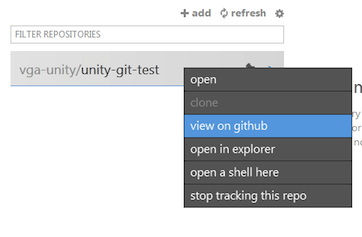

こんな感じで GitHub 側に自分の作成したリポジトリのページができていることを確認できます（中身はまだ空です）。

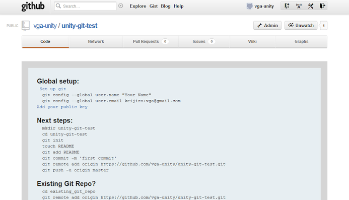

次に、ローカル側のリポジトリのありかも見てみましょう。右クリックメニューから "open in explorer" を選択します。マイドキュメントの GitHub 化にあるはずです。

今はまだ Git の設定ファイル (.gitignore, .gitattributes) しか存在しません。

### Unity プロジェクトの作成

まずは練習ということで、ごく簡単な Unity プロジェクトを管理してみることにしましょう。いきなりリポジトリの中にプロジェクトを作るとちょっと面倒なことが起こるので、仮でデスクトップにプロジェクトを作成します。

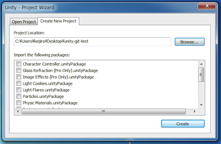

箱と光源を置いただけのシンプルなシーンにしてみました。それと、スクリプト Cube.js を作成して、中身は空っぽのまま箱に与えてあります。

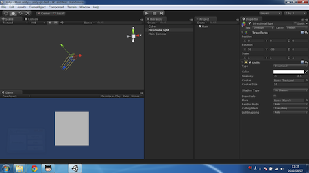

これから、このプロジェクトを GitHub でバージョン管理するのですが、その前に Unity 側の設定を少しいじっておく必要があります。"Edit" メニューの "Project Settings" から "Editor" を選択してください。Inspector に Editor Settings が表示されます。

そこで次のような変更を行います。

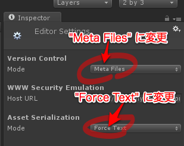

1. "Version Control" の "Mode" を "Meta Files" に変更。
1. "Asset Serialization" の "Mode" を "Force Text" に変更。

(2) は別にやらなくてもいいですが、せっかくなのでやっておくとよいです。

これでリポジトリに入れる準備はできました。いったん Unity を終了し、リポジトリのありかと、今さっき作成した Unity プロジェクトをエクスプローラーで開きます。

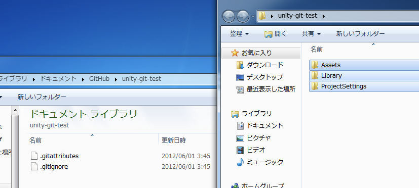

Unity プロジェクトの中身をリポジトリ側にブチ込みましょう。 sln ファイルだの何だのができている場合は、それも一緒に入れちゃいましょう。

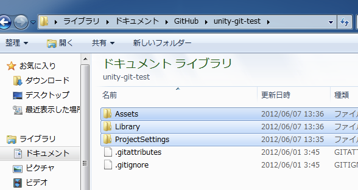

### 最初のコミット

プロジェクトの中身をリポジトリ側のディレクトリに入れると、その変更を GitHub for Windows が自動的に検出します。こんな感じで「uncommitted changes （コミットしていない変更）があるよ！」と表示してきます。

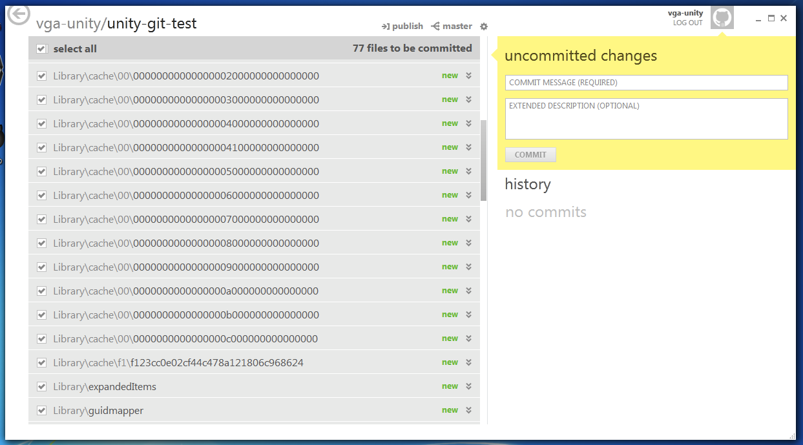

ただ、検出された内容を見てみると、だいぶムダなものが含まれているのが分かります。Library ディレクトリ以下は中間生成物なので管理する必要がないですし、sln ファイルだの何だのも管理する必要はありません。これらのムダなファイルを無視する設定を行いましょう。

歯車アイコンから "settings..." を選択します。

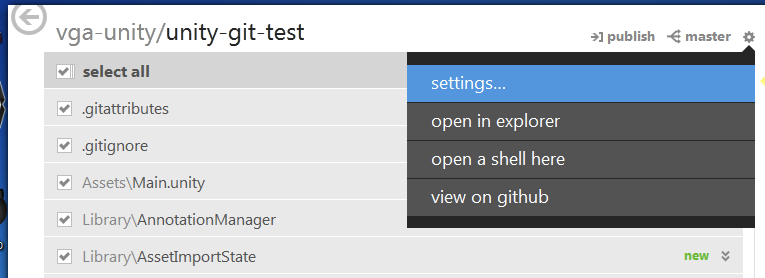

こんな感じで設定ファイルを編集する画面に遷移します。

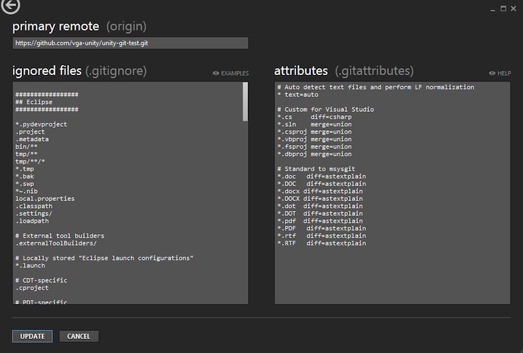

左側にある "ignore files" というのが「無視するファイル」の設定です。ここにムダなファイルを列挙しましょう。

以下の行を追加します。

    Library
    Temp
    *.pidb
    *.unityproj
    *.sln
    *.userprefs

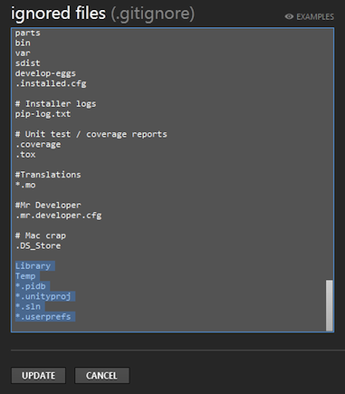

入力し終えたら "Update" ボタンを押して適用します。すると、自動検出されたファイルが次のように必要最小限の構成に変化しているはずです。

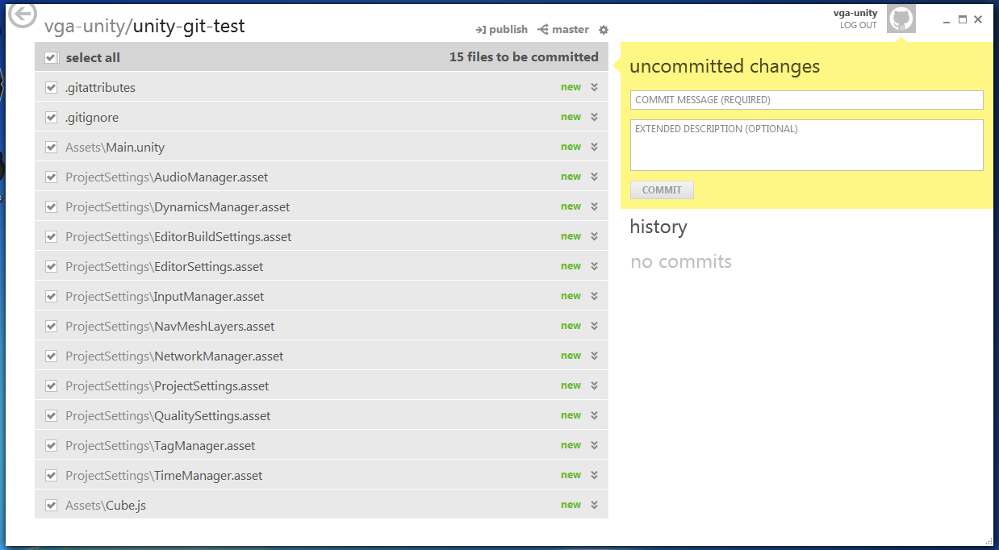

これをコミットすることにしましょう。コミットメッセージを入力してから "Commit" ボタンを押します。

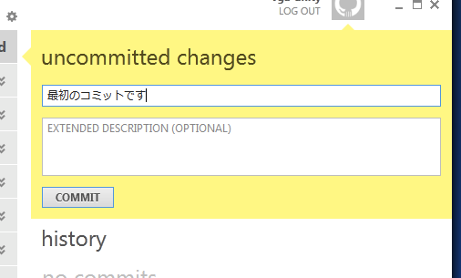

コミットに成功すると、こんな感じで履歴として表示されます。"unsynced commits" というのは「まだ GitHub サーバー側にはアップしていないコミット」という意味です。

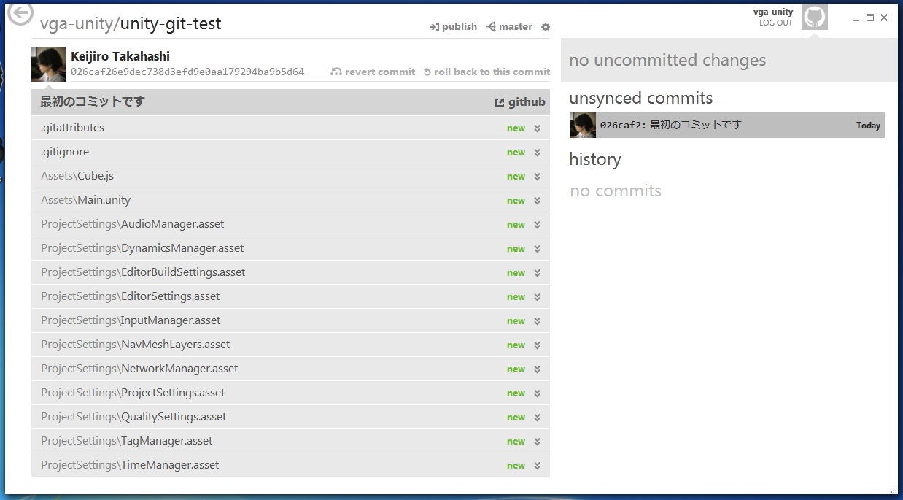

### 変更のコミットと同期

新規登録作業はこれで完了したので、次はこれに対して変更を行っていきます。とりあえず Cube.js に何かてきとうな追加変更を行ってみましょう。

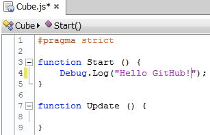

変更を行うと、これを GitHub for Windows が自動検出します。

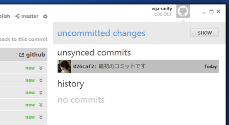

"Show" ボタンを押して検出内容を表示しましょう。

変更対象がテキストファイルの場合、このように変更内容が具体的に表示されます。

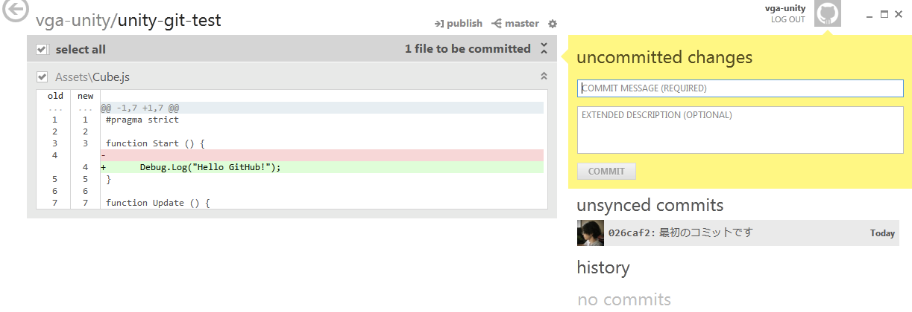

赤は変更によって削除された部分、緑は変更によって追加された部分を表します。

問題ないので、これでコミットしましょう。コミットメッセージは分かりやすく簡潔に書きましょう。

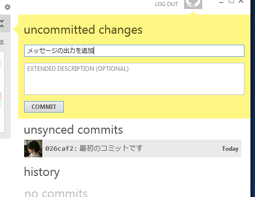

コミットすると、unsynced commits が 2 つに増えます。このようにコミットの度に履歴が蓄積されていきます。

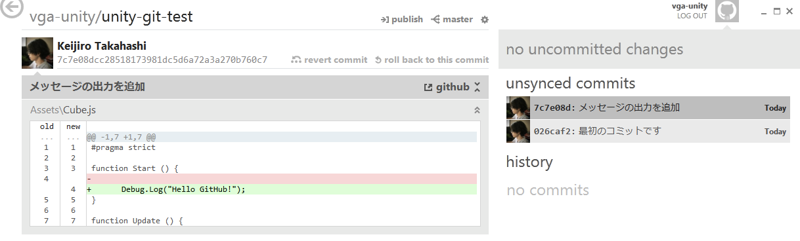

そろそろ、これらの変更を GitHub サーバー側と同期しましょう。"Publish" ボタンを押します。

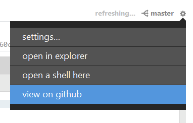

同期を開始するとプログレスバーが表示されます。しばらくすると完了するはずです。正常に完了すると、次のように履歴が history 側へ移ります。

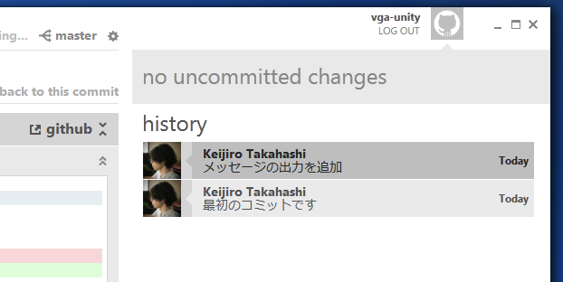

これでこれらの変更は、GitHub サーバー上から全世界へと共有されました！

ちゃんと公開されていることを GitHub ウェブサイト側で確認してみましょう。歯車メニューから "view on github" を選択します。

こんな感じで、変更後の状態が公開されているはずです。

このページの真ん中あたりにある "Commits" タブを開くと、コミットの履歴を見ることができます。

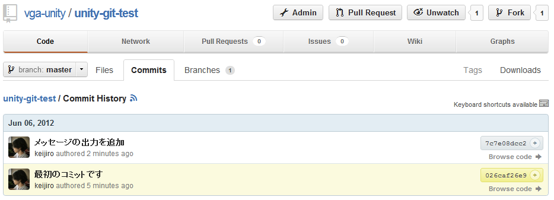

ちゃんと履歴も含めて共有されていることが分かりました。

### コラボレーション作業

以上が GitHub を一人で使う場合のチュートリアルです。ここから先は、共同開発者とのコラボレーションについて解説します。

まずは、このリポジトリに共同開発者（コラボレーター）を加える作業を行います。GitHub ウェブサイト上のリポジトリのページを開き、 "Admin" ボタンを押します。

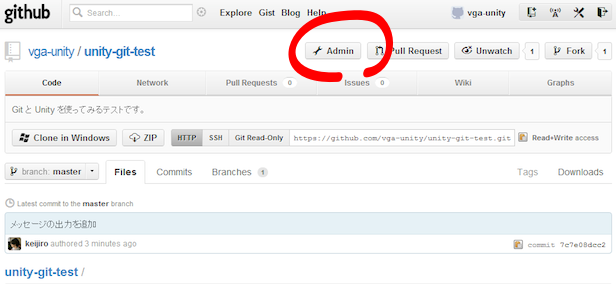

管理用画面に遷移します。ここから "Collaborators" を選択します。

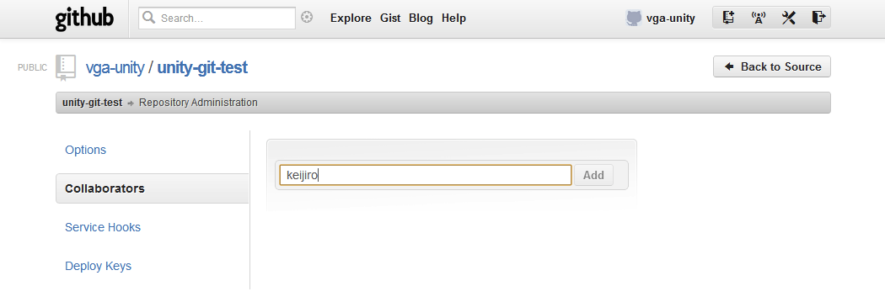

まだコラボレーターは一人も居ないので空です。ここで上のように、エディットボックスの中にコラボレーターのユーザー名（あるいはメールアドレス）を入力して Add ボタンを押します。

成功すれば、次のようにコラボレーターが登録されるはずです。

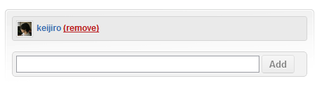

こうして登録されたコラボレーターは、このリポジトリを閲覧するだけでなく、変更を同期することが可能となります。

追加されたコラボレーターの人は、GitHub for Windows を開きましょう。次のように "github" 側のリストの中に、共有されたリポジトリの名前が出現しているはずです。

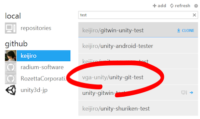

"Clone" ボタンを押して、このリポジトリをクローンします。クローンとは、リポジトリを GitHub サーバー側からローカル側へと引き出してくることを表します。リポジトリをクローンしてしまえば、あとは普通に自分のリポジトリと同じように扱うことができます。

### コラボレーターと同期する

ここで、コラボレーターに頼んで、Cube.js に適当な変更を行ってみてもらいましょう。変更をコミットして、それを GitHub サーバーと同期するところまでやってもらいます。

コラボレーター側の作業が完了したら、その作業結果をこちら側と同期させてみましょう。GitHub for Windows 上でリポジトリを開いて、上の方にある "sync" ボタンを押します。

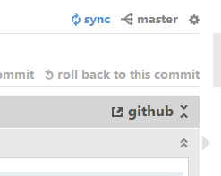

プログレスバーが出現して、しばらく待たされます。うまくいけば、次のようにコラボレーター側の変更がこちら側のリポジトリに反映されるはずです。

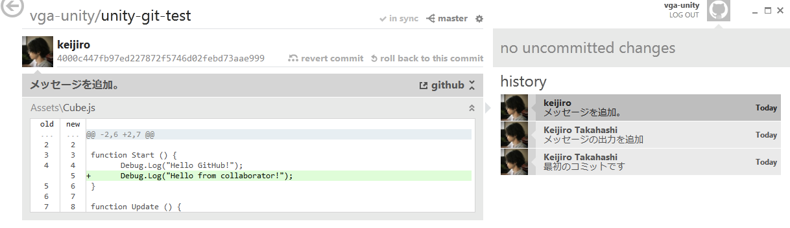

分かりにくい画面でごめんなさい。history のいちばん上にある「メッセージを追加」はコラボレーターが行った変更です。"Hello from collaborator!" と表示する処理を追加したようですね。

### 同時編集による衝突の解決

このような感じでコラボレーター間で変更内容を共有し、共同作業を進めていくことができます。ただし、こう事が平和裏に進んでくれるのは、それぞれの変更個所が重なっていない場合のみです。複数のコラボレーターが同時に同じ箇所を変更した場合、その変更は「衝突」(conflict) として検出されます。衝突は機械的に処理することができません。必ず手作業によって、これを解決する必要があります。

衝突の解決を一度やってみることにしましょう。まずは複数人で同時に同じ箇所を変更し、ローカル側にコミットするところまで作業します。Cube.js に何かユニークなメッセージを追加する、などが例としてよいでしょう。

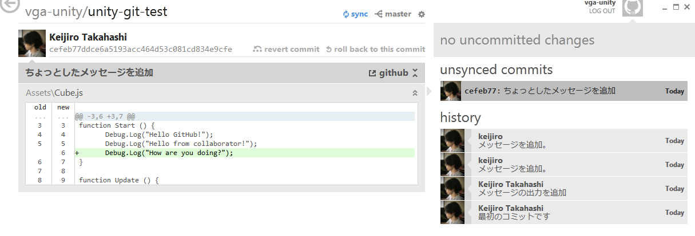

まずは、誰かがこの変更を GitHub サーバー側と同期しましょう。最初の同期はうまくいくはずです。

次に他の誰かが同期を行うと、そこで衝突が発生します。次のようなメッセージが表示されるはずです。

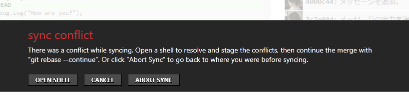

「衝突が発生したので、shell を開いて手作業で解決するか、あるいは中断する (abort) か決めてよ」というような感じのメッセージです。ここでは "open shell" ボタンを押して解決作業を開始することにします。

Shell というのは、いわゆるコマンドラインのことです。こんな感じで殺風景なウィンドウが開きます。

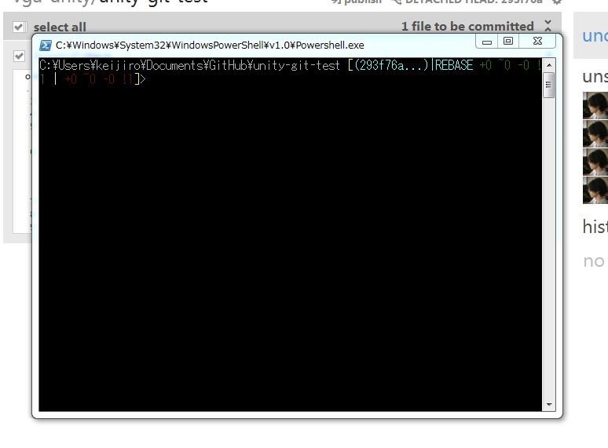

ここから git コマンドを使って解決作業を行うのですが、ちょっと心もとないので GUI を使うことにしましょう。 "git gui" と入力します。

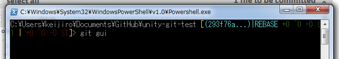

次のように、Git 標準の GUI が出現します。GitHub for Windows と比べると、ちょっとレトロな感じですが、これが本来の Git に付属しているツールです。

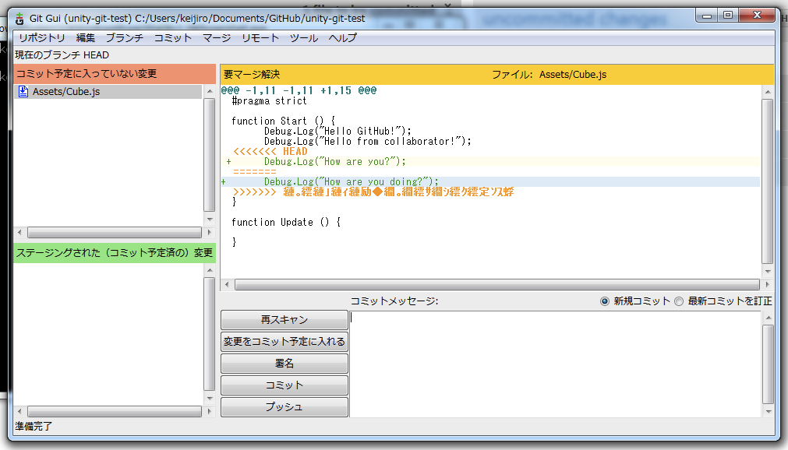

この画面では衝突の内容が表示されています。もし、衝突している部分に関して、自分の変更は破棄して、相手の変更だけを適用するならば、右クリックメニューの「リモートの方を採用」を実行するだけで解決が完了します。

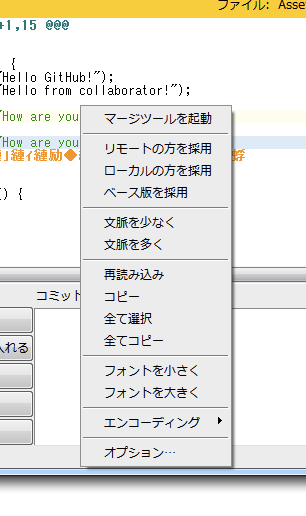

逆に、空いての変更を破棄して、自分の変更だけを適用するならば、「ローカルの方を採用」を実行します。

ただ多くの場合は、自分の変更も相手の変更も同時に残しておきたいでしょう。このような場合は手作業で変更を行います。エディターで衝突しているファイル（ここでは Cube.js）を開きます。

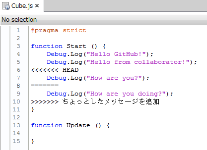

衝突を起こしている箇所は "<<<<<<", ">>>>>>" のようなマークで括られています。この中を整理して、ちゃんとした形に直してやります。

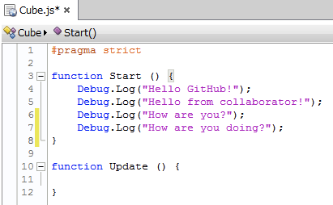

こんな感じでよいでしょう。

変更が完了したら Git の GUI に戻ります。変更の完了したファイルを選択して、メニューの「コミット」から「コミット予定する」を実行します。すると、そのファイルは「ステージングされた（コミット予定済の）変更」に移動するはずです。

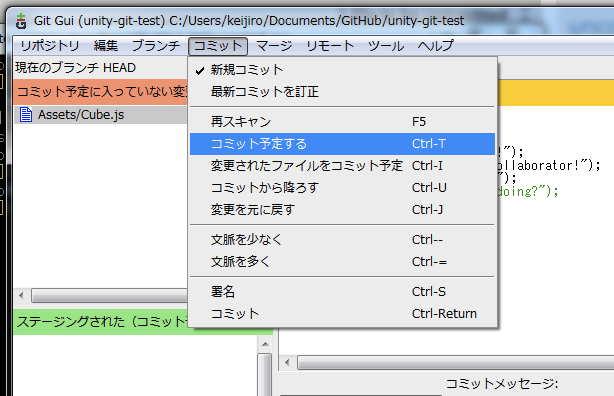

これで Git の GUI の作業は終わりです。GUI は閉じて Shell へ戻ります。最後に、衝突の解決が完了したことを伝えるためのコマンド "git rebase --continue" を実行します。

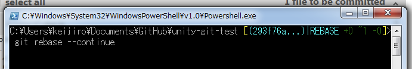

成功したら exit で shell を終了させましょう。

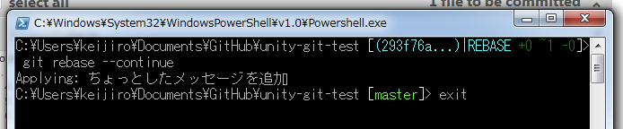

ここまでの作業がうまくいっていれば、解決作業の内容が unsynced commits としてコミットされているはずです。

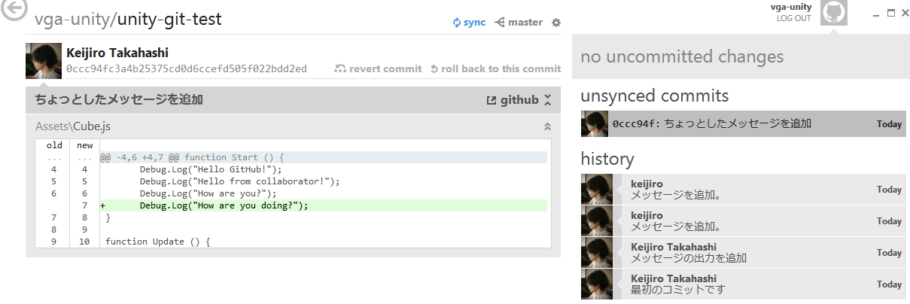

あらためでここで sync しましょう。この間に他の人がまた衝突を作っていなければ、今度こそ同期に成功するでしょう。

同期に成功したら、GitHub ウェブサイト上でコミットを確認してみましょう。

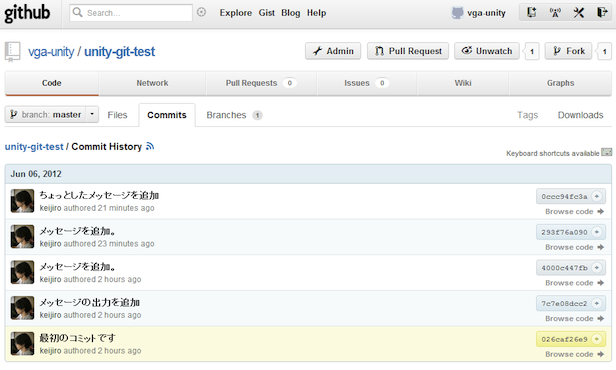

お疲れさまでした。
